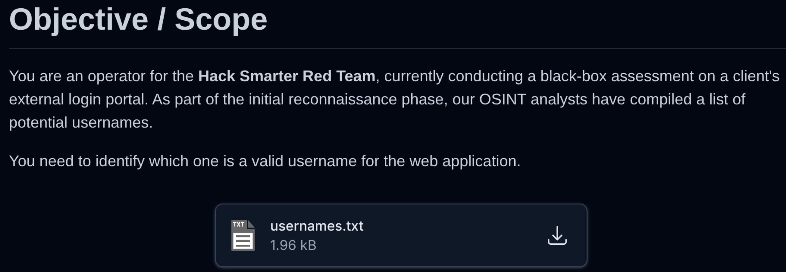
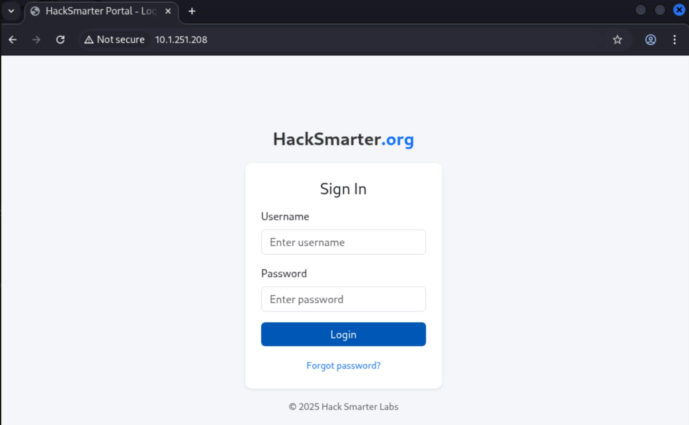
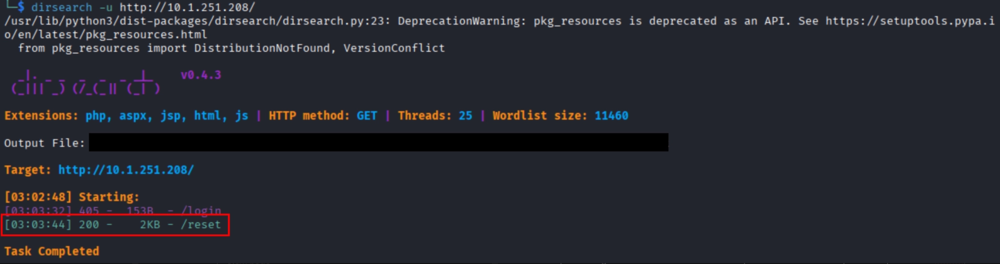

# Scope:

#  Recon:

## Network and port scanning with nmap:

 

## Enumeration of Http service on Port 80

-We then setup Caido or burpsuite so we can start crawling and enumerating port 80.

-Typically right before vising the application i like to start directory busting, and crawl the app while the scan is happening. We do find a /reset directory which likely correlates with the “forgot password” feature in the login page as seen below.

BEHOLD! A login page for HackSmarter(.)org
 

## Dirbusting with Dirsearch

 

# Enumeration
## Username Enumeration with Caido

Upon using “test” as the username and password we intercept the request with Caido, notice how we receive a 200 status code even though authentication failed.

 

Now we are going to intercept the request again, but this time send it to “automate” (the “intruder” equivalent from burpsuite). We will utilize the usernames.txt file that was so kindly provided to us, and conduct username enumeration. Whats happening here is that we use a wordlist full of usernames to cycle in the 'Username' Parameter. The hopes is that we find a user, based off of a status code, length, or round-trip time that drastically deviates from the norm.

 

Upon running the attack, we unfortunately dont get anything useful. The status codes, length, and round-trip time are all the same or very similar. Also, we are not receiving any feedback from error codes because there are none (Good job Hacksmarter).

 

## Testing the "Forgot Password" Feature

After entering “test” as the username we receive a little feedback.

 

So now we test this with Caido, and capture the request then send to automate. We use the same usernames list. The status codes, and length are the same or very similar. However, this time, we find a user (joey) with an extremely long round-trip time.

 

When entering the name into the challenge lab, we get a success, therefore ending the challenge.

 
