#  Synopsis of "Basic Pentesting"

The Basic Pentesting room on TryHackMe is a beginner-friendly, semi-guided Capture The Flag (CTF) challenge designed to teach foundational penetration testing skills.  It simulates a vulnerable machine where learners practice core techniques including service enumeration, web directory discovery, brute-forcing weak credentials, hash cracking, and privilege escalation. 

The machine presents multiple attack paths. One common route involves using nmap to identify open ports (such as SSH, HTTP, SMB), then discovering a hidden directory (/development) via tools like gobuster or dirb.  The discovered files (dev.txt and j.txt) hint at a user named Jan with a weak password.  A hydra brute-force attack on SSH using the rockyou.txt wordlist successfully gains initial access. 

For privilege escalation, two primary methods exist:

SSH Key Exploitation: An exposed RSA private key for user kay is found and cracked using John the Ripper with the passphrase beeswax, granting full access. 
SUID Binary Exploitation: A misconfigured SUID binary (like vim) allows a privileged read of the pass.bak file, revealing the password for user kay, who has unrestricted sudo privileges. 
The room emphasizes real-world vulnerabilities such as weak passwords, improper file permissions, and unpatched services. It's ideal for building confidence and reinforcing skills before tackling more complex challenges.

# Recon & Enumeration


## Network and Port Scanning 

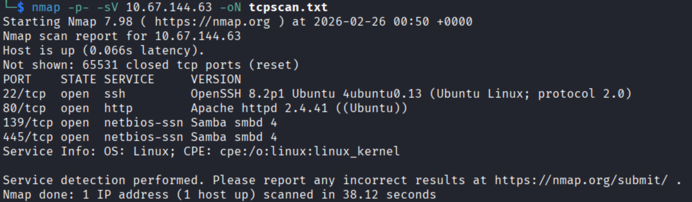 


Mention Flags used--
## Enumeration of Port 80

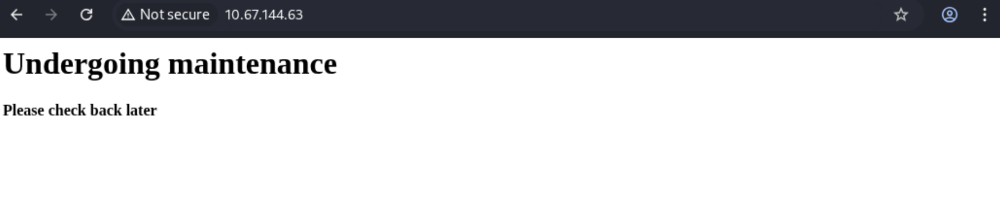 


**Viewing Page Source:**
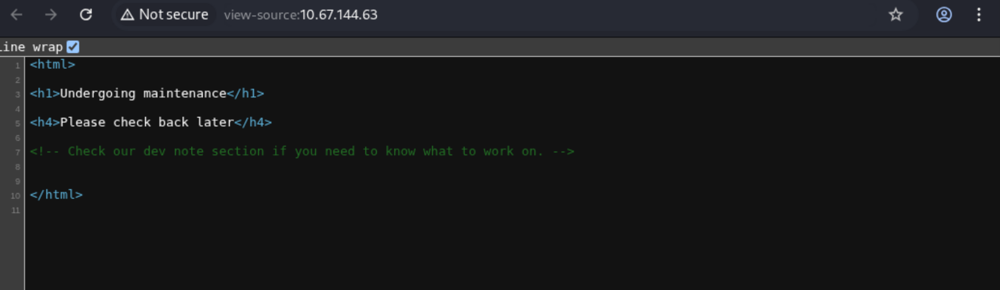 

**Dirsearch found a development directory, so lets check it out.**
```
dirsearch -u http://10.67.144.63/
```
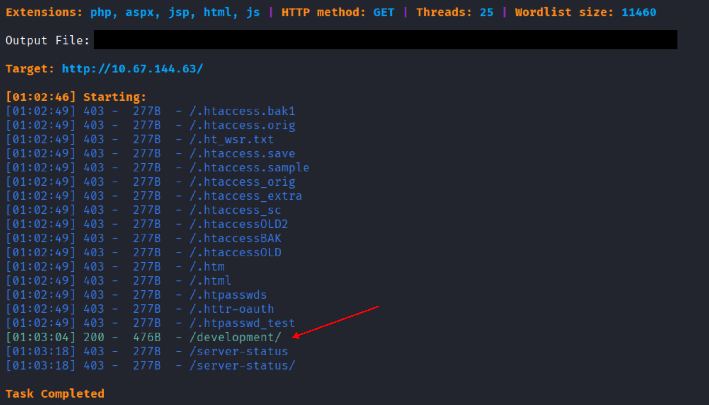 

**Behold the development directory. We can see a dev.txt and a j.txt. We also notice that the Apache version is shown as well.**
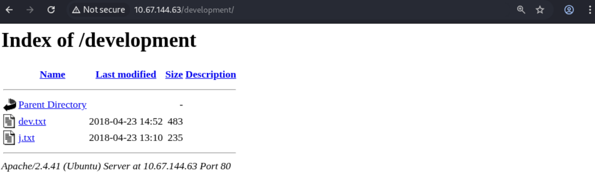 


**Dev.txt:**

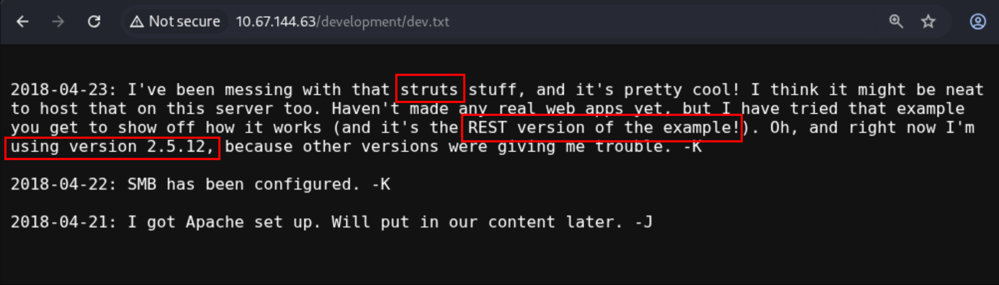 

**So the devs are utilizing the "REST" version of struts, more specifically version 2.5.12.  Here's a little info on struts:**
 

**Heres some more info, that deals more specifically with the 2.5.12 version**

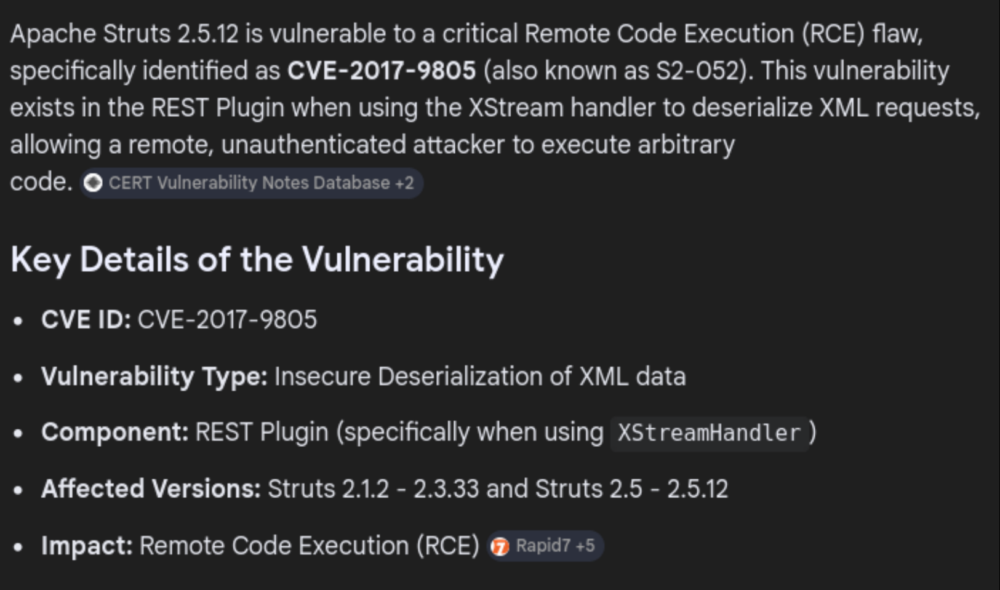 

**At this point we can simply google CVE-2017-9805 and find an exploit, or we can also use searchsploit on terminal to see if there are any available exploits for struts 2.5.12. Since we know that the devs are using the "REST" version we will utilize the last exploit.**

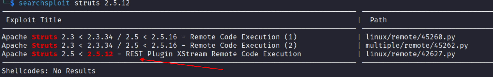 

 **We copy the exploit code to our current directory. Make sure to read the code so you have an idea on what the attack is doing.** 
 
```
cp /usr/share/exploitdb/exploits/linux/remote/42627.py .
```
(When utilizing this script, nothing happend, so I instead kept on enumerating.)

**j.txt**
**Now j.txt is showing us that J had some weak credentials. If we are lucky enough J hasnt changed it and so we can potentially guess the password.**

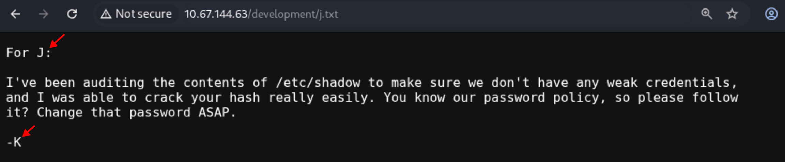 


## Enumeration of Port 445 SMB

**There are three things to notice here.** 
1. **We can log into smb as guest with no pass**
2. **The domain is ec2.internal**
3. **The guest has read permissions for the Anonymous share.**

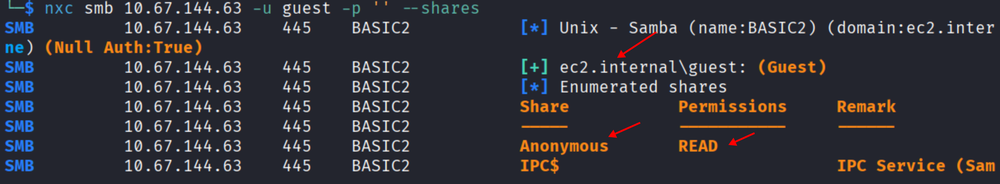 

**Now we go and read the Anonymous Share. We find a file called "staff.txt", so we download that file.**

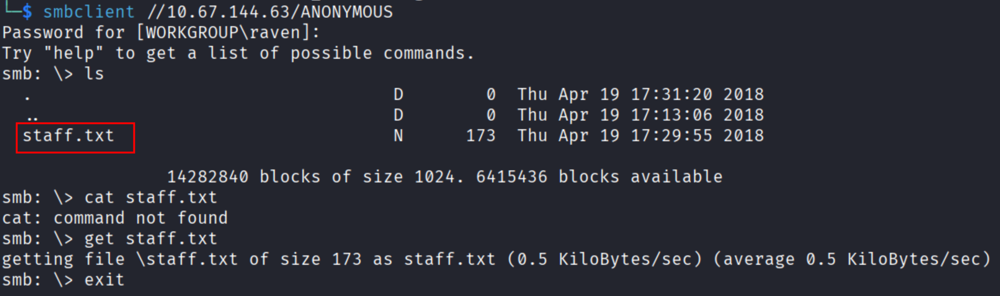 

**We now learn who "k" and "J" are. They are "Jan" and "Kay"**

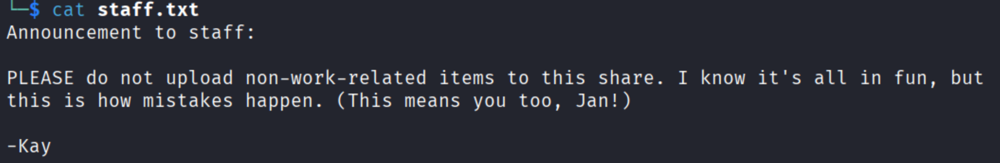 


# Password Cracking on Jan's account

**Now lets hope that their names are also their usernames. During our enumeration of port 80 we didnt find any login portals. Also, smb only had two shares where one was already readable by guest. Therefore, We will try to crack their ssh password via hydra.**

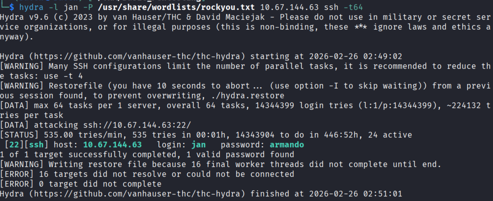 

**And BAM! We got a hit!**
**ssh jan:armando**

# Enumerating Jans account

**Unfortunately when looking around, I couldn't find much that the Jan user could access. Kay has a password.bak file but Jan has no access to it. Checked programs with the SUID bits but nothing really stood out. Checked capabilities and the environment but still nothing. Checked if we could use sudo, but Kay is not in the sudoers file. So, finally i decided to run linpeas. We received a ton of information, some cve's that we could try but towards the end I was able to see kay's private ssh keys. It turns out that there is a security misconfiguration because private keys should only be readable and writable by the owner, but in this instance anyone can read it.**

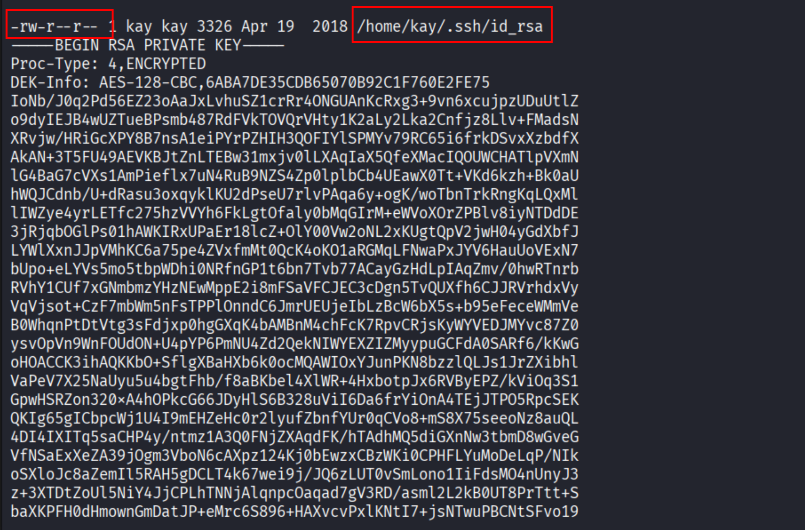 
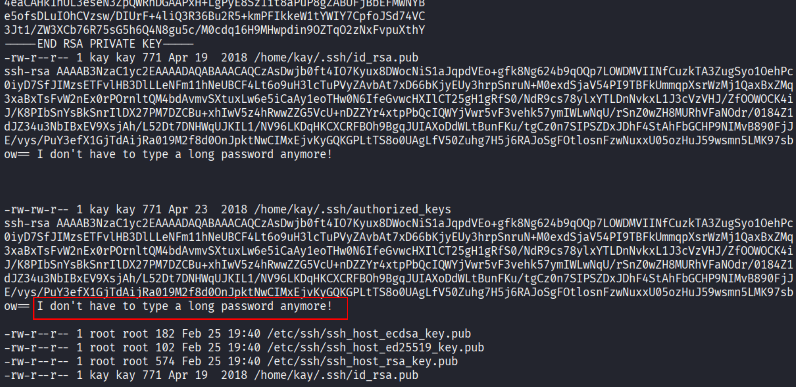 


# Privillege Escalation to "Kay"

**Well now that we have Kay's private keys we can ssh into her account without a password.**

**Well I thought we could ssh into her account but instead i kept getting the error:**
**"Load key "id_rsa": error in libcrypto" and was asked for a password which we dont know.**

**It turns out that after a bit of research there was a formatting error. The first two lines after "BEGIN RSA PRIVATE KEY" needed to have a space between it and the base64 code. Now that we created that space, we are able to utilize the file to ssh into kays account.**

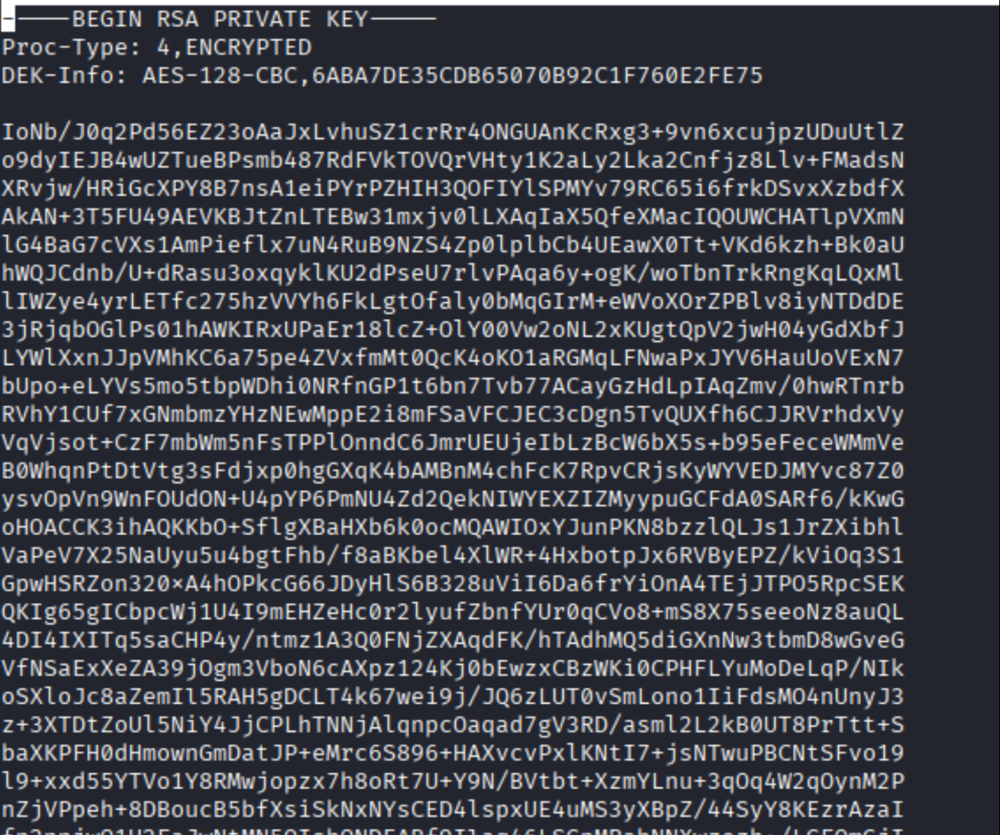 


**At least I thought we did, hahaha! Turns out we still need a passphrase. The first two lines in the id_rsa file does let us know that the key is encrypted as well, silly me.**

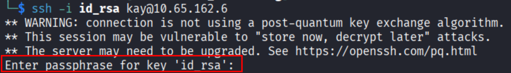 


**This is where the homie john the ripper comes in. We utilize ssh2john which converts the private key into a formatted crackable hash that is understood by john, then place it into a file (sshcrack.txt).**

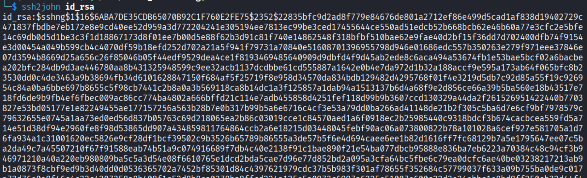 

**We then take this hash and have john crack it so we can receive the passphrase, which is "beeswax".** 

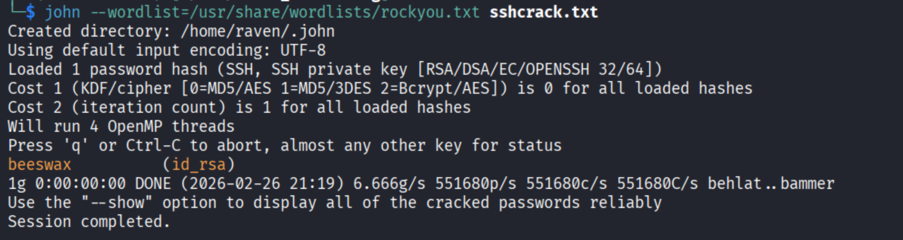

**Now we CAN ssh into the server as the user "Kay"**

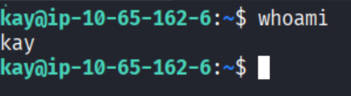 


# Privillege Escalation to "Root"

**And finally we are able to escalate our privileges to root by using the backed up password in Kay's home directory.**
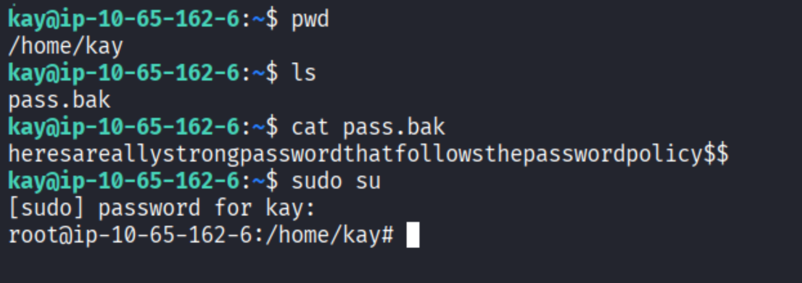 

